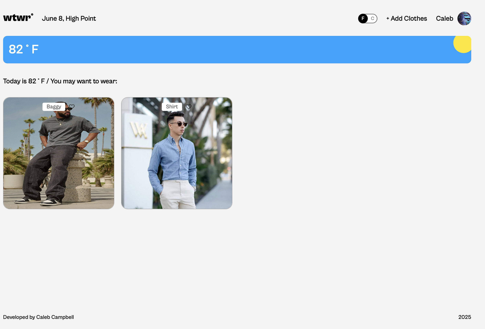
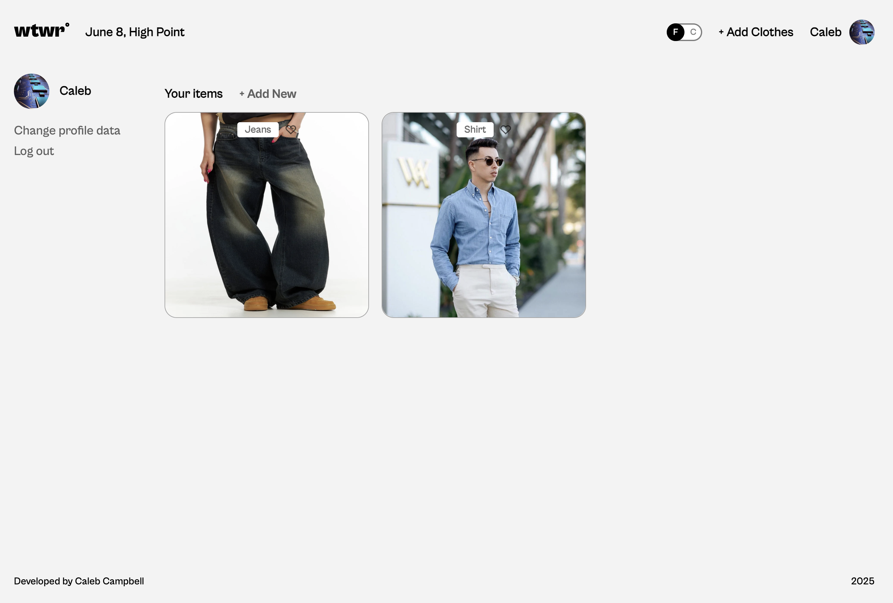
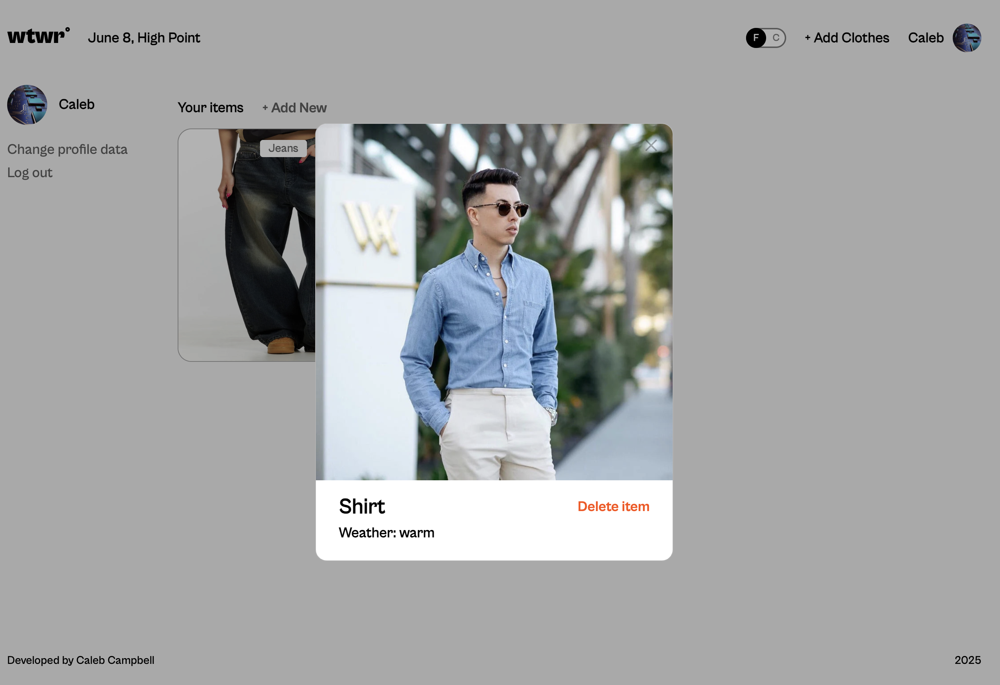

# What to Wear (WTWR)

## Description:  
> WTWR (What To Wear) is a full-stack React application that helps users choose appropriate clothing based on the current weather at their location. Users can view weather-specific outfits uploaded by others, or add and manage their own garments, which are showcased on their personal profile page.

> The application features full authentication and authorization using JSON Web Tokens (JWT), and a responsive front end built with React. It communicates with a Node.js and Express backend, with data persisted in a MongoDB database.

## Overview

### Main Page

### Profile Page

### Clothing Card Modal

## Technologies Used
> React (Frontend)    
> Node.js  
> Express.js  
> MongoDB  
> JWT Authentication & Authorization  
> CSS BEM Methodology  

## Check it out here:  
> ### Deployed: [https://whattowear.ftp.sh/]  
> ### What to wear (WTWR) [backend](https://github.com/cccampb2/se_project_express)

## Live Demo
> Live Demo Coming Soon

## Future Ideas/Work
> In the future, I plan to enhance WTWR by dynamically retrieving the user’s latitude and longitude based on their device’s geolocation, replacing the currently hardcoded location. This will provide a more accurate and personalized weather-based clothing recommendation experience. By integrating real-time location data, the application will better reflect local weather conditions and further improve the overall user experience.

